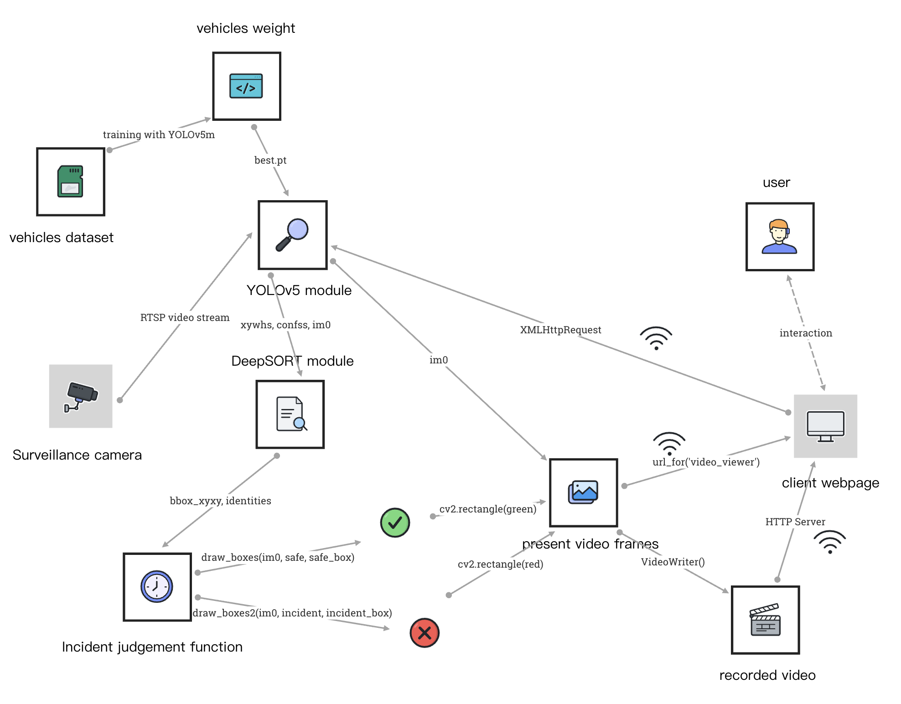
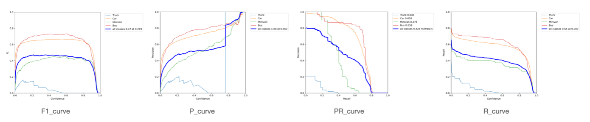
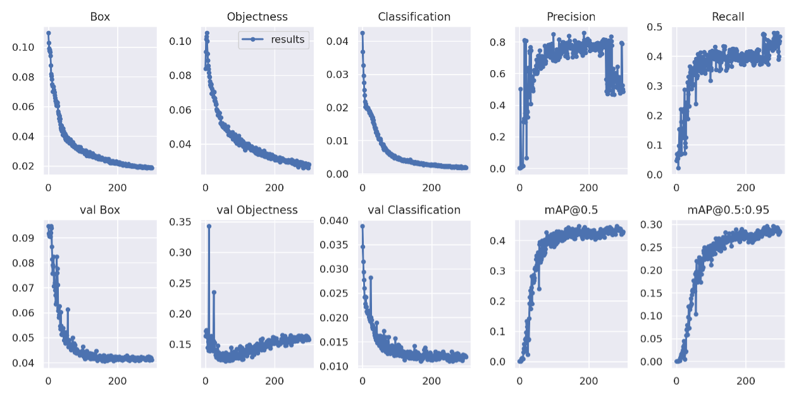
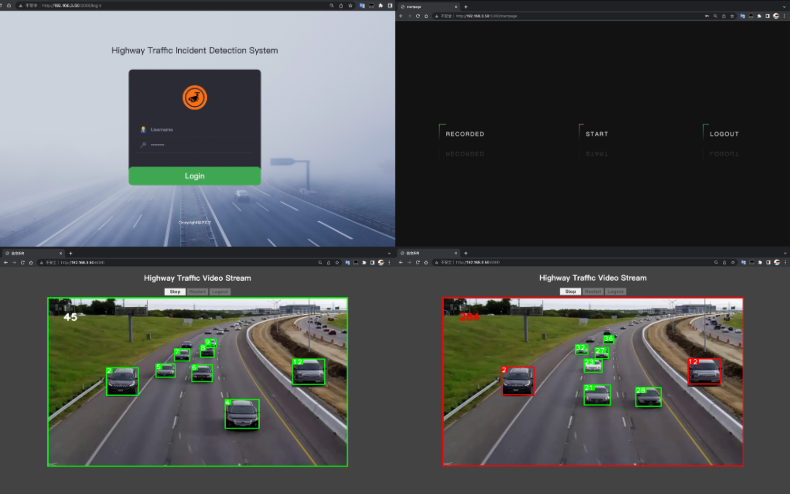

# yolov5-deepsort-traffic-incident-detection

### Project Description

The overarching goal is to empower traffic management authorities to swiftly detect and respond to incidents, thereby safeguarding road safety and averting potential emergencies. Addressing this challenge, this project introduces an expressway traffic incident detection system built on object recognition techniques. By leveraging YOLOv5 for vehicle detection and DeepSORT for vehicle tracking, coupled with Flask framework to create an interactive web interface, this system is able to perform real-time analysis of live videos captured by expressway surveillance cameras, and provide user-friendly web interface to enhance user experience.

### Design and Implementation

1. **System design**

- Model: YOLOv5 vehicles training, DeepSORT.

- Video transmission and protocol: RTSP protocal enabling real-time, but videos are also acceptable.

- User access: within local area network (LAN).

- Incident detection: mark incident vehicles with red bounding box, record incident video, send alert email to pre-set account.

   

2. **YOLOv5 weight training**

- Dataset: [UA-DETRAC](https://detrac-db.rit.albany.edu/) (540 images for training and 121 images for validation).

- Training results:

   

   

3. **User interface**

   

## Environment Configuration

**Python Environment:** Python 3.6 is recommended as the environment of the server.

**Install Required Packages:** Open a terminal and navigate to the project directory. Run the following command to install the necessary packages:

```
pip install -r requirements.txt
```

## How to Run

1. **Configure the Video Source:** In the `source.yaml` file 

and write the link for the target video. i.e.  The video file gonglu3.mp4 is a testing MP4 video. You can also refer to [rtsp-simple-server](https://github.com/aler9/rtsp-simple-server) to create live video stream for testing.

2. **Launch the Server:** Execute the following command in your terminal: 

   ```
   python main.py
   ```

3. **Access the Interface:** Open the browser and navigate to `localhost:5000/`. The term `localhost` here refers to the IP address of the server within your LAN.

## File Structure
```
yolov5-deepsort-traffic-incident-detection
.
│
├── controller
│    ├ modules
│    │  ├ home
│    │  │  └ views.py
│    │  └ user
│    │     └ views.py
│    ├ static
│    │  ├ css
│    │  │  ├ startpage.css
│    │  │  └ style.css
│    │  ├ images
│    │  ├ inference
│    │  ├ deep_sort_pytorch
│    │  │  ├ configs
│    │  │  │  └ deep_sort.yaml
│    │  │  ├ deep_sort
│    │  │  │  ├ deep
│    │  │  │  └ deep_sort.py
│    │  │  └ utils
│    │  └ yolov5
│    │    ├ weights
│    │    │  └ best.py
│    │    ├ detect.py
│    │    └ train.py
│    ├ templates
│    │  ├ index.html
│    │  ├ login.html
│    │  ├ startpage.html
│    │  └ main.html
│    ├ utils
│    │  ├ yolo_deepsort.py
│    │  └ camera.py
│    └ __init__.py
├── inference
│    └ output
├── yolov5-training
│    └ DETRAC
│       ├ Vehicles
│       │  ├ train
│       │  │  ├ images
│       │  │  └ labels
│       │  ├ valid
│       │  │  ├ images
│       │  │  └ labels
│       │  └ data.yaml
│       ├ yolov5
│       │  └ runs
│       └ yolov5.ipynb
├── config.py
├── main.py
├── requirements.txt
├── source.yaml
├── img
├── highway-video.mp4
└── system_demo_video.mp4
```

